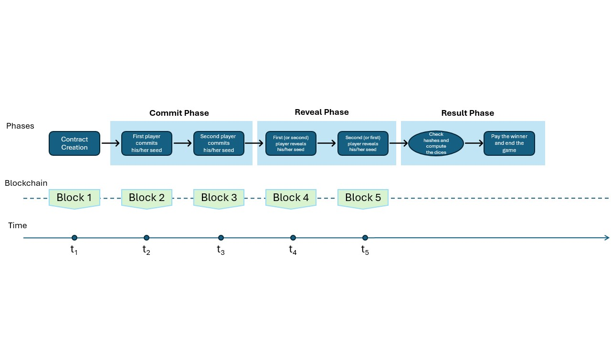

# CRYPTO-DICE

A blockchain implementation of a simple dice game where players take turns rolling dice, and the player with the highest roll wins.

The implementation is designed to ensure two basic security properties.
<ol>
  <li>Integrity: Any attempt by an attacker to alter actions taken by players is prevented, as actions are committed 
    through signed transactions, publicly recorded on the blockchain.</li>
  <li>Indisputable Correctness: The code determining the game's winner is openly available on the blockchain. 
    This transparency allows players to verify that no cheating or bugs are involved, a level of assurance not possible in client-server application architectures.</li>
</ol>
 

## Rolling the Dices

The game ensures an indisputable random dice roll through the implementation of a commitment scheme mechanism, consisting of three phases:
* **Commit Phase**: Players enter the game by committing the hash of a randomly chosen seed and submitting 1 Ether. 
* **Reveal Phase**: Participants reveal the values of their initial random seeds.
* **Result Phase**: The winner is determined, and rewarded based on the random dice roll.
  
A player's random dice roll derives from combining their own seed, the opponent's seed, and the hash of the block mined at the conclusion of the reveal phase.
By considering all three values - the seeds of both players, and the hash of the mined block - we ensure that the random entropy
cannot be influenced independently by any of the three entities: the players or the miner of the specific block.  

The flow diagram, depicting user actions, phases, and the creation of blocks as a function of time is presented in the figure
bellow.

## Setting up the environment

To run the application locally, it's necessary to install a blockchain simulator environment,
such as **[Ganache](https://trufflesuite.com/ganache/)**. The communication between the blockchain and the Web Application is facilitated by
the web3.js library, utilizing sockets. To enable the communication, ensure that your local blockchain environment
is configured to listen on **port 8546**.

The necessary migration scripts are provided in the **migrations** folder.
Deploying the smart contracts to Ganache is straightforward; simply execute the **truffle migrate** command.

The React-based web application requires the **Node.js** runtime environment for its execution.
Once Node.js is installed, download the needed dependencies, by running the Node command
**npm install**, in a terminal which sees the root folder of the project.
After successfully downloading the dependencies, initiate the application by running the **npm start** command.
This will launch a simple Node.js server and deploy the web application to it.

The local deployment of your application can be found at the URL (http://localhost:3000/).
To start playing, a player must input the following though their UI:
* The hash of their chosen random seed.
* The blockchain address of the deployed CryptoDice smart contract.
* The player's own blockchain address.
* The IP address of the RCP endpoint (127.0.0.1 in the case of a locally deployed Ganache).
* The port of the RCP endpoint (8546 in the case of a locally deployed Ganache).

A game concludes when each player commits the initial value of their seeds through their UI. 

All the needed cryptographic primitives are provided through the CreateHash smart contract.
CryptoDiceSecond is a secondary smart contract created to verify the correctness of the implementation of our main smart contract.
